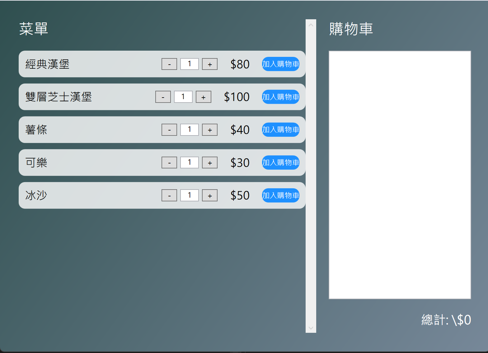

# 現代點餐系統



## 介紹

現代點餐系統是一款使用 WPF（Windows Presentation Foundation）開發的桌面應用程式，旨在提供直觀且高效的點餐體驗。該系統允許使用者瀏覽菜單、選擇所需菜品的數量，並將其添加到購物車中進行結算。界面設計現代且具有科技感，適合餐廳、咖啡廳等各類餐飲業者使用。

## 功能特點

- **菜單顯示**：清晰列出所有可供選擇的菜品，包含名稱和價格。
- **數量選擇**：使用者可調整每個菜品的數量，通過增加（+）或減少（-）按鈕，或直接輸入數字。
- **加入購物車**：選定菜品和數量後，可將其添加到購物車中。
- **購物車管理**：
  - 顯示已選擇的菜品、數量和小計。
  - 計算並顯示總計金額。
  - 支援移除購物車中的任意菜品。
- **現代化 UI**：使用圓角按鈕和漸層背景，提供舒適的視覺體驗。
- **輸入驗證**：確保數量輸入為有效數字，避免錯誤輸入。

## 技術棧

- **語言**：C#
- **框架**：WPF (.NET Core / .NET Framework)
- **工具**：Visual Studio

## 安裝與運行

### 前置需求

- **Visual Studio**：建議使用最新版的 Visual Studio 以獲得最佳開發體驗。
- **.NET SDK**：確保已安裝相容的 .NET Core 或 .NET Framework SDK。

### 步驟

1. **克隆專案**

   ```bash
   git clone https://github.com/你的帳號/現代點餐系統.git
   ```

2. **打開專案**

   - 使用 Visual Studio 打開 `Project1.sln` 解決方案檔案。

3. **還原 NuGet 套件**

   - 在 Visual Studio 中，右鍵點擊解決方案，選擇 **還原 NuGet 套件**。

4. **編譯並運行**

   - 按下 **F5** 鍵或點擊 **開始** 按鈕來編譯並運行應用程式。

## 使用說明

1. **瀏覽菜單**

   - 啟動應用程式後，主界面將顯示所有可供選擇的菜品。

2. **選擇數量**

   - 使用 `+` 和 `-` 按鈕調整每個菜品的數量，或直接在數量框中輸入所需數字。

3. **加入購物車**

   - 調整好數量後，點擊「加入購物車」按鈕，該菜品將被添加到右側的購物車中。

4. **查看購物車**

   - 購物車將顯示所有已選擇的菜品、數量和小計。
   - 總計金額將自動計算並顯示在購物車底部。

5. **移除項目**

   - 若需移除購物車中的某個菜品，點擊對應的「移除」按鈕即可。

## 貢獻指南

歡迎任何形式的貢獻！如果你有改進建議或發現了問題，請通過以下步驟提交你的貢獻：

1. **Fork 此專案**
2. **建立你的特性分支** (`git checkout -b feature/新功能`)
3. **提交你的更改** (`git commit -m '新增功能'`)
4. **推送到分支** (`git push origin feature/新功能`)
5. **創建一個 Pull Request**

## 授權條款

此專案採用 [MIT 授權](LICENSE)。

## 聯繫我們

如有任何問題或建議，請通過 [電子郵件](mailto:rx@rx.futuracept.com) 與我們聯繫。
